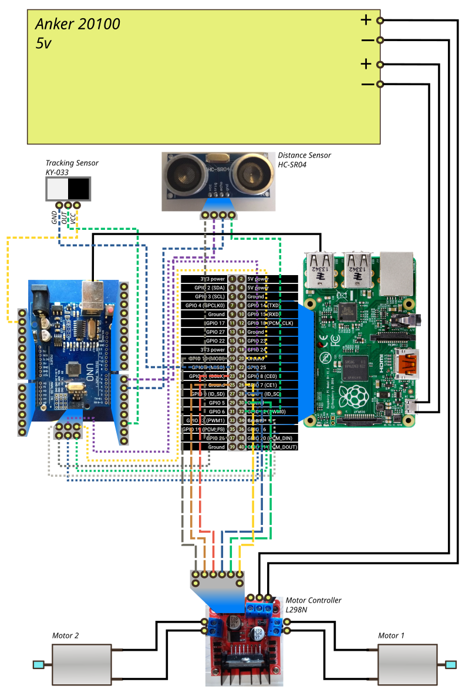

# Robot v1.0.2

Resources to build a robot.

# WHY this guide?
- I invested some time to make the first version work, and now I want to take a snapshot and move on to version 2.  
- I have very specific Hardware, most notably an <old> Raspberry pi B. Most of the docs online refer to the newer boards.  
- I want to share a reproduceable code and docs for other people to possibly improve on.

# Status

First version works with some caveats. The robot will not kill you unless you build that feature on top of this. Therefore, version 1.

## What it can do
Follow a list of rules regarding movements. Those rules can be based off what we get from the sensors. Basically it can do both of the following by choosing a different set of move_cfg.yaml rules:
- Time-based movements. One second to the front, two seconds turn to the left, ten seconds to the back...
- Objects avoiding robot. Move forward until an object is closer than 10 cms, then turn until there's nothing closer than 10 cms, then move forwards again.
- A mix of both. Move forward until an object is closer than 10 cms, rotate clockwise for a second, if still there's somthing closer than 10 cms, rotate counter-clockwise until there's nothing close than 10 cms, then move forwards again.

## Version 1
### Hardware
#### What to get
- Raspberry pi 1 B+. Probably anything newer will even work better.
  - A Wifi dongle like [this one](https://www.amazon.com/Edimax-EW-7611ULB-Wi-Fi-Bluetooth-Adapter/dp/B01KVZB3A4/ref=sr_1_2?dchild=1&keywords=edimax+wifi+dongle&qid=1599231989&sr=8-2)
- [Bought this pack for the following:](https://www.banggood.com/Geekcreit-DIY-L298N-2WD-Ultrasonic-Smart-Tracking-Moteur-Robot-Car-Kit-for-Arduino-products-that-work-with-official-Arduino-boards-p-1155139.html?rmmds=myorder&cur_warehouse=UK)
  - Arduino UNO as sensor controller. Check [ARDUINO.md](ARDUINO.md). [Bought this one](https://www.banggood.com/Geekcreit-DIY-L298N-2WD-Ultrasonic-Smart-Tracking-Moteur-Robot-Car-Kit-for-Arduino-products-that-work-with-official-Arduino-boards-p-1155139.html?rmmds=myorder&cur_warehouse=UK)
  - L298N as motor controller. Check [L298N.md](L298N.md).
  - HC-SR04 as distance sensor  
  - 2 motors  
- A tracking sensor (got mine from [HERE](https://www.banggood.com/Geekcreit-37-In-1-Sensor-Module-Board-Set-Starter-Kits-SENSOR-KIT-For-Arduino-Plastic-Bag-Package-p-1137051.html?rmmds=myorder&cur_warehouse=UK))
- Several Jumper cables Male, female...get from both.
- Some 3mm nuts and bolts to fix chips to the chassis.
- Chassis made of Cardboard and plastic  
- [Anker Powercore 20100](https://www.amazon.com/Anker-PowerCore-Powerbank-Kapazit%C3%A4t-Technologie-Schwarz/dp/B00VJT3IUA). There is a newer model and I guess it will also work.
- Weight: 897 grams  

#### How to put it together
So far I don't have much more than a testing platform built with two small-ish boxes glued together and put on top of the Robot car kit chassis.  

   

    
### Connections

### Software
- Prepare the programs you want to run on the arudino. Check [ARDUINO's README](ARDUINO.md) for details on how the arduino programs should work, or have a look at the ones under ./arduino.
- Install everything required on the Raspberry pi. Check [our Raspberry Install process](RASPBERRY.md) for a HOW-TO.
- By the end of that process, and after you have everything connected, just plugin the battery in and everything should just work. Hopefully

### Challenges for v2
- We need to add a compass among other sensors to keep our robot moving straight
- We want to add some LEDs for output, and a microphone for input
- It doesn't do much on its own. We should focus on skills.  
- Installation is not straghtforward
- Chassis is not reproducible
- Weight should be lowered, anything under 1 Kg is fine I guess  
- I have smaller powerbanks but they dont work well with the L298N motor controller  
- Further software challenges, check bottom of [BRAIN'S own README](https://github.com/angelalonso/robot/blob/master/brain/README.md)

 
