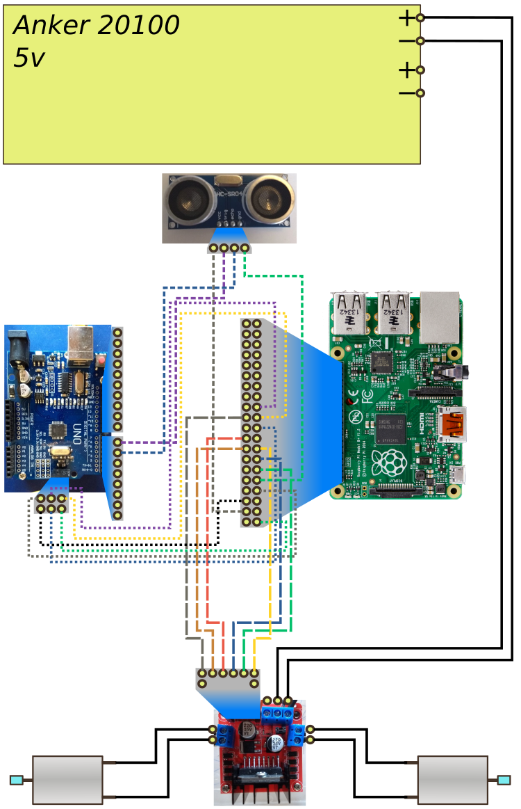

# Robot

Resources to build a robot.

# WHY this guide?
- I invested some time to make the first version work, and now I want to take a snapshot and move on to version 2.  
- I have very specific Hardware, most notably an <old> Raspberry pi B. Most of the docs online refer to the newer boards.  
- I want to share a reproduceable code and docs for other people to possibly improve on.

# Status

First version works with some caveats.

## Version 1
### Hardware
- Raspberry pi 1 B+ as Brain runner and movement controller. Check [RASPBERRY.md](RASPBERRY.md)  
- [Bought this pack for the following:](https://www.banggood.com/Geekcreit-DIY-L298N-2WD-Ultrasonic-Smart-Tracking-Moteur-Robot-Car-Kit-for-Arduino-products-that-work-with-official-Arduino-boards-p-1155139.html?rmmds=myorder&cur_warehouse=UK)
  - Arduino UNO as sensor controller. Check [ARDUINO.md](ARDUINO.md). [Bought this one](https://www.banggood.com/Geekcreit-DIY-L298N-2WD-Ultrasonic-Smart-Tracking-Moteur-Robot-Car-Kit-for-Arduino-products-that-work-with-official-Arduino-boards-p-1155139.html?rmmds=myorder&cur_warehouse=UK)
  - L298N as motor controller. Check [L298N.md](L298N.md).
  - HC-SR04 as distance sensor  
  - 2 motors  
- A tracking sensor (got mine from [HERE](https://www.banggood.com/Geekcreit-37-In-1-Sensor-Module-Board-Set-Starter-Kits-SENSOR-KIT-For-Arduino-Plastic-Bag-Package-p-1137051.html?rmmds=myorder&cur_warehouse=UK))
- Several Jumper cables Male, female...get from both.
- Chassis made of Cardboard and plastic  
- [Anker Powercore 20100](https://www.amazon.com/Anker-PowerCore-Powerbank-Kapazit%C3%A4t-Technologie-Schwarz/dp/B00VJT3IUA). There is a newer model and I guess it will also work.
- Weight: 897 grams  

### Connections

TBD - Diagram as of October 2020, with the added tracking sensor

### Software
- Brain runs on the Raspberry pi from the ./brain folder. Check [BRAIN'S own README](brain/README.md)
  - Brain hot-installs .hex files from the ./arduino folder. Check [ARDUINO's README](ARDUINO.md) for further details on how the arduino programs should work.

### Challenges for v2
- Installation is not straghtforward
- Chassis is not reproducible
- Weight should be lowered, anything under 1 Kg is fine I guess  
- It doesn't do much on its own  
- I have smaller powerbanks but they dont work well with the L298N motor controller  
- Further software challenges, check bottom of [BRAIN'S own README](https://github.com/angelalonso/robot/blob/master/brain/README.md)

 
