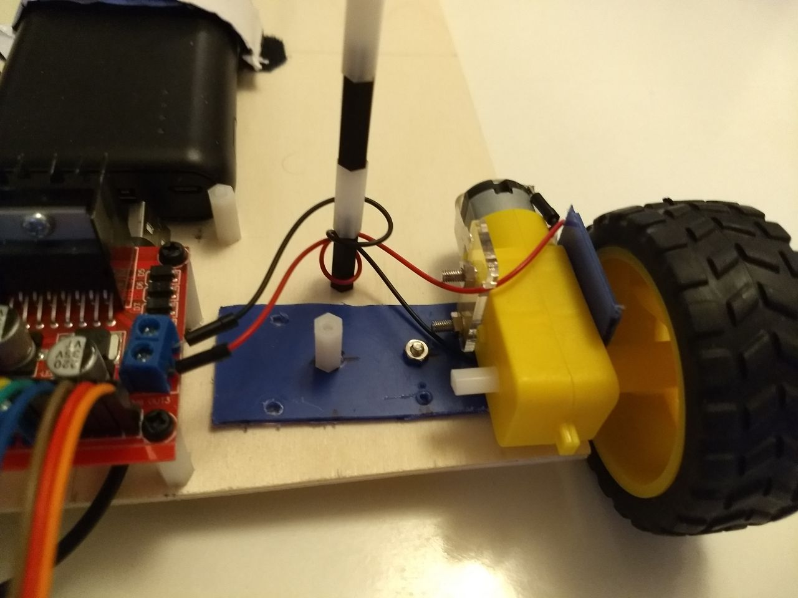
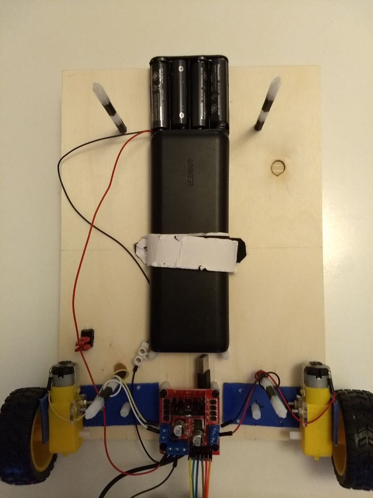
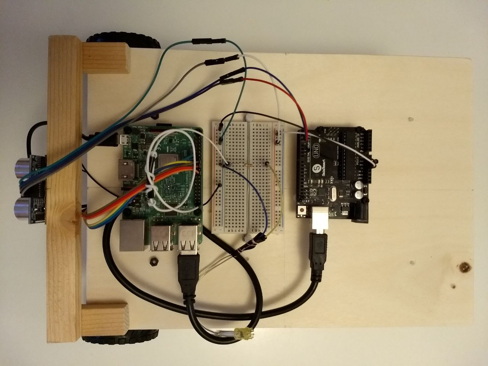
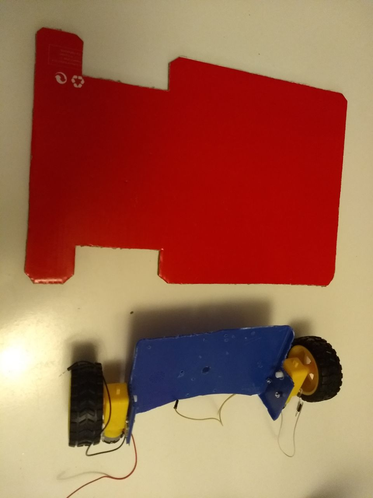
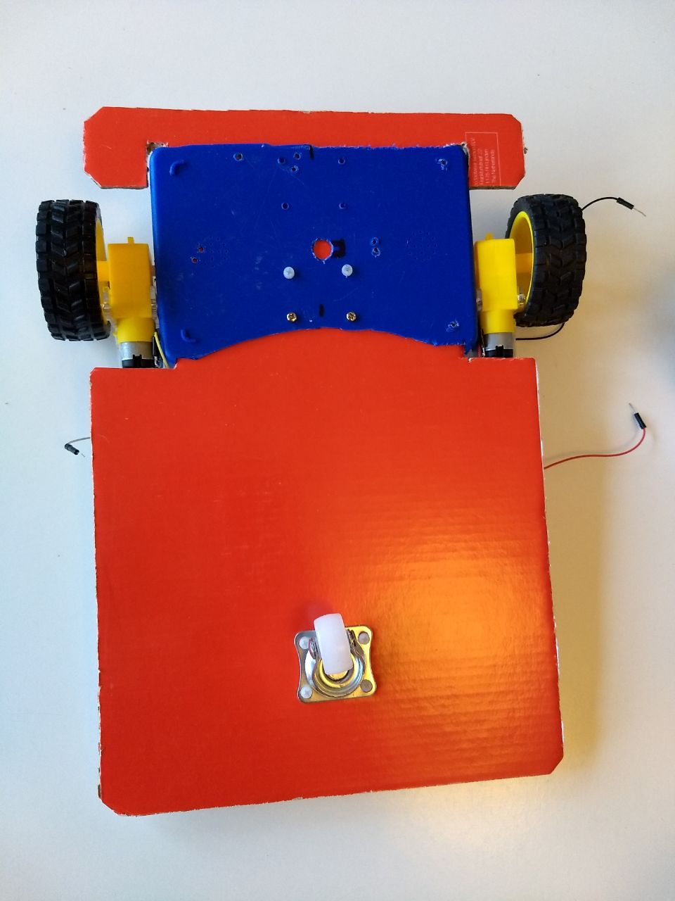

# Building a chassis for our robot

First of all, this is a temporary solution. I have built several "chassises" for this project before and I am pretty sure the best option is to 3D print something.

For the time being, you can put together a useful structure if you keep the following in mind:

- You need the structure to leave enough room for all components and cables
- The more open your structure is, the easier it will be to work on it
- The default chassis I got with my robotic kit (see [Shopping List](./000_ShoppingList.md)) was too small
- Weight should be distributed evenly. The battery will take most of that weight

## My current build

I reused the old plastic lunch box approach (see My First Build) and cut it in two halves, to be able to separate the wheels to the width of the A4 layer.



For the rest of the chassis I used 2 plywood A4 sheets. 

Batteries, motors and the Motor controller go on the bottom layer.

The 4xAA Battery pack is followed by the 2xAA Battery pack (in serial), and then connected to the L298N, which is itself connected to both motors and to the Raspberry Pi on the top layer.

The Anker Powercore will power Raspberry on the top layer with its USB cable.

- For now, just connect the Motors to each side of the L298N (I honestly am not sure which one is which, just don't tighten too much and be ready to switch them if needed).



Raspberry, a breadboard, the future Arduino, as well as any new inputs and outputs will probably need to fit on the upper layer.



- Now use six cables to connect the L298N to GPIO Pins at the Raspberry Pi as follows:

```
               |_                       _|
MotorA, out 1--|O|                     |O|--MotorB, out 1
MotorA, out 2--|O|        _         _  |O|--MotorB, out 2
               |" _____  |x|       |x|  "|
               |_|O|O|x|_|O|O|O|O|O|O|___|
                  | |     | | | | | |
             Vcc--+ |     | | | | | +-EnaMotorB ---> GPIO25, pin 22 Raspberry
             GND----+     | | | | +---MotorB, in2 -> GPIO24, pin 18    " 
                          | | | +-----MotorB, in1 -> GPIO23, pin 16    " 
                          | | +-------MotorA, in2 -> GPIO27, pin 13    "
                          | +---------MotorA, in1 -> GPIO17, pin 11    "
                          +-----------EnaMotorA ---> GPIO22, pin 15    "

 ```
FYI, this is the GPIO map of the Raspberry:

```               _______________ 
                           .___. |            
                  +3V3---1-|O O|--2--+5V
          (SDA)  GPIO2---3-|O O|--4--+5V
         (SCL1)  GPIO3---5-|O O|--6--_
    (GPIO_GLCK)  GPIO4---7-|O O|--8-----GPIO14 (TXD0)
                      _--9-|O.O|-10-----GPIO15 (RXD0)
    (GPIO_GEN0) GPIO17--11-|O O|-12-----GPIO18 (GPIO_GEN1)
    (GPIO_GEN2) GPIO27--13-|O O|-14--_
    (GPIO_GEN3) GPIO22--15-|O O|-16-----GPIO23 (GPIO_GEN4)
                  +3V3--17-|O O|-18-----GPIO24 (GPIO_GEN5)
     (SPI_MOSI) GPIO10--19-|O.O|-20--_
     (SPI_MOSO) GPIO9 --21-|O O|-22-----GPIO25 (GPIO_GEN6)
     (SPI_SCLK) GPIO11--23-|O O|-24-----GPIO8  (SPI_C0_N)
                      _-25-|O O|-26-----GPIO7  (SPI_C1_N)
       (EEPROM) ID_SD---27-|O O|-28-----ID_SC Reserved for ID EEPROM
                GPIO5---29-|O.O|-30--_
                GPIO6---31-|O O|-32-----GPIO12
                GPIO13--33-|O O|-34--_
                GPIO19--35-|O O|-36-----GPIO16
                GPIO26--37-|O O|-38-----GPIO20
                      _-39-|O O|-40-----GPIO21
                           '---' |
                                 |
(_ means Ground)
```

- Finally connect the Raspberry to the Anker Powerpack to start the system, configure it...and so on, and you can also connect the 6xAA Battery Pack to the L298N once you are ready to have the motors move.
 
 
## Obsolete now: My first build

I took an old plastic lunch box that was 16.5cms x 11.5cms and had at least a height (bottom to middle cut) of 3cms.


I cut it in two and removed the top part and some unneeded plastic at the borders, then prepared some holes to fix the motors

For the rest of the chassis I prefer an open layer, in this case made of two cardboards taken from a Shoes box.



We will call that thing our chassis from now on.



I put all components together on top of the chassis to decide on the best distribution possible. Bear in mind that you will want to add some more elements in the future.
