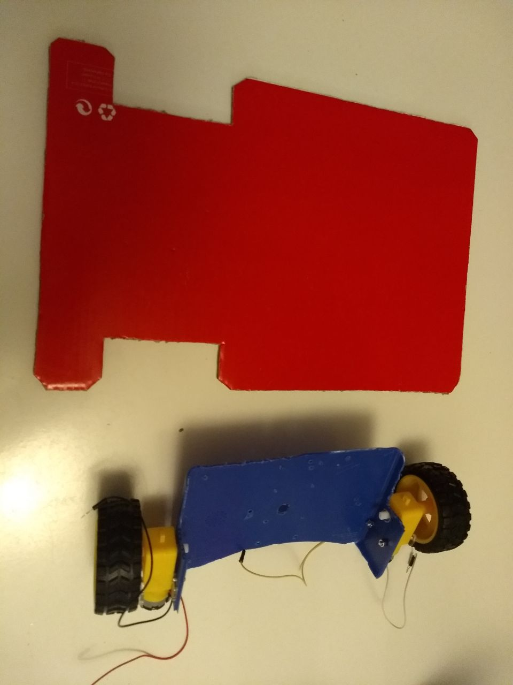
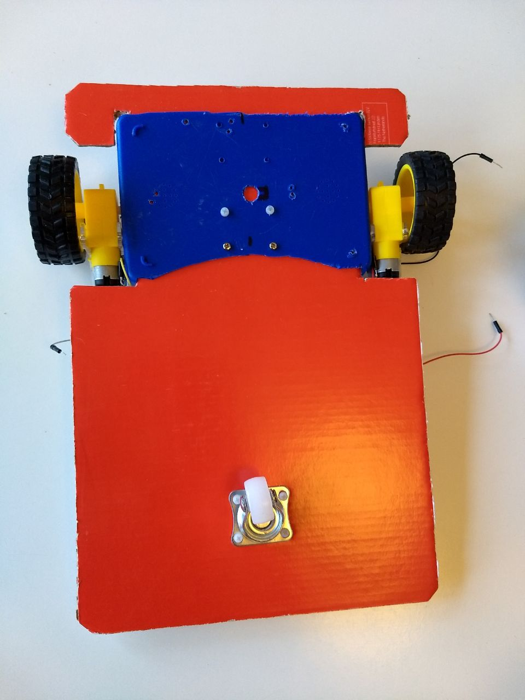

# Building a chassis for our robot

First of all, this is a temporary solution. I have built several "chassises" for this project before and I am pretty sure the best option is to 3D print something.

For the time being, you can put together a useful structure if you keep the following in mind:

- You need the structure to leave enough room for all components and cables
- The more open your structure is, the easier it will be to work on it
- The default chassis I got with my robotic kit (see [Shopping List](./000_ShoppingList.md)) was too small
- Weight should be distributed evenly. The battery will take most of that weight

## My current build

I reused the old plastic lunch box approach (see My First Build) and cut it in two halves, to be able to separate the wheels to the width of the A4 layer.

For the rest of the chassis I used to plywood A4 sheets. 

Batteries, motors and the Motor controller go on the bottom layer.

aspberry, a breadboard, the future Arduino, as well as any new inputs and outputs will probably need to fit on the upper layer.

## Obsolete now: My first build

I took an old plastic lunch box that was 16.5cms x 11.5cms and had at least a height (bottom to middle cut) of 3cms.

I cut it in two and removed the top part and some unneeded plastic at the borders, then prepared some holes to fix the motors

For the rest of the chassis I prefer an open layer, in this case made of two cardboards taken from a Shoes box.

We will call that thing our chassis from now on.

I put all components together on top of the chassis to decide on the best distribution possible. Bear in mind that you will want to add some more elements in the future.
