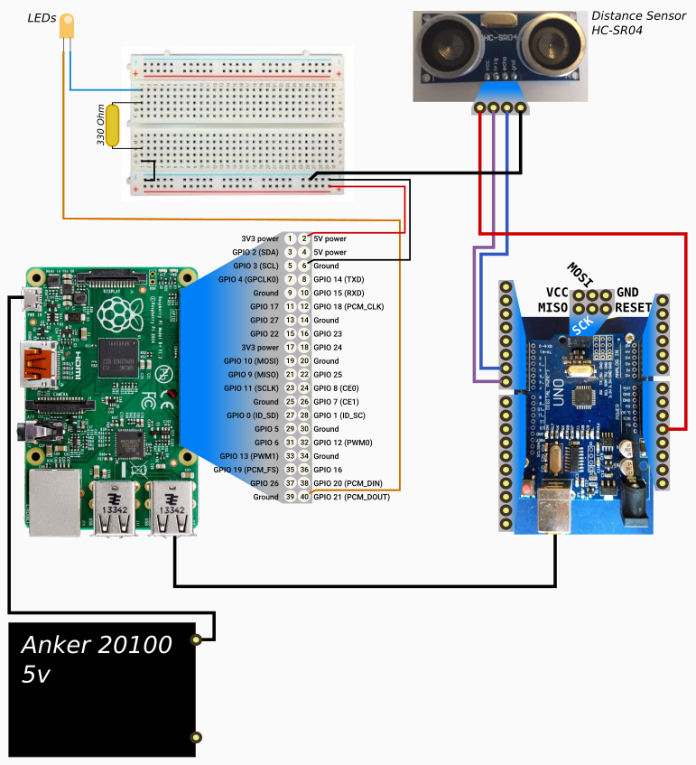

# Setup and manifest

## Problem we want to solve

Having a basic robot with an Arduino kit is nice but the Arduino has a very small amount of memory, which limits what we can do with our robots.

## Manifest

In other words, these are the basic design premises we will try to stick with:

- Arduino 
  - receives data from "input" sensors (distance, button being pushed...)
  - sends messages to the Raspberry with that data.
- Raspberry
  - decides what needs to be done and when.
  - physically modifies "output" objects (LEDs, motors...)
  - loads programs into the Arduino when needed.
  - all of the above is done from a so-called "brain" program that is configurable.

## Connections

We will be providing power from the Raspberry pi to the Arduino via USB, and communications through the ICSP Pins

# Challenges
- Our current setup seems to be a bit slow on reaction times and that might be a design flaw

[PREV: Shopping List <--](000_ShoppingList.md) [--> NEXT: Preparing the Raspberry](002_Raspberry.md)
