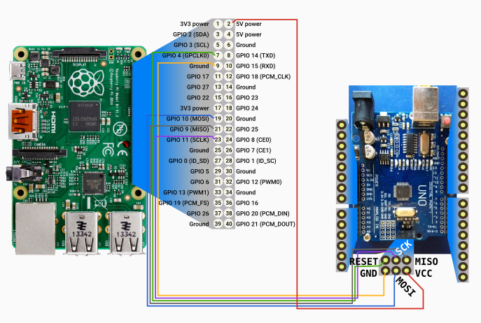

# How to setup your Arduino

# Regular Workflow

In order to have your brain program communicate with the Arduino you'll need to:
- Connect Arduino to your laptop with the USB Cable
- Using Arduino IDE, open the program you want to load (currently we use [this one](https://github.com/angelalonso/robot/tree/master/arduino/000_sensors/000_sensors.ino)), and upload it to the Arduino
- while you are adding it, you can use 
```
$ ./do_savearduinohex.sh 000_sensors 
```
 to make a copy of the .hex file into the related folder (useful for manual installation)
- Disconnect the Arduino and connect it to the Raspberry pi, using the same USB cable.
- Once the Raspberry boots, the arduino will boot too

## Notes on writing programs
Communication from Arduino to Raspberry occurs through messages on the Serial.
- There are three types of messages; actions, metrics and the rest, which should just be used as logs  
  - Action messages start with "ACTION: "
    - The rest of the message contains the trigger that will make brain take an action.
    - If you want your robot to do something, configure an entry on brain/cfg.yaml(copy and paste is your friend), and make your program send something like:
```
    delay(50);
    Serial.println("ACTION: talk_dirty");
```
  - Metrics messages start with "SENSOR: data\_"
    - The full message looks like "SENSOR: data\_distance\_20", where distance is a sensor brain recognizes and 20 is the value we got from that sensor.
    - The arduino part of sending that message looks like:
```
    delay(50);
    Serial.print("SENSOR: data_distance_");
    Serial.println(dist); # dist is defined previously and stores values directly from your sensor.
```
  - Information ones start with "LOG: "
- As you have seen on the examples above, we need to have a ```delay(50)``` (or more than 50) between two println commands, to allow brain to read both in two separate tries.

# Trick: Bootloader recovery

IF you ever have your Arduino Bootloader messed up (Symptom: the Arduino IDE throws "not in sync" errors), you can use the Raspberry to recover it.

You'll need to setup the ICSP connection between both as follows:



After that, you'll need avrdude to be installed and configured on the Raspberry. For that follow [Raspberry's own setup docs](./RASPBERRY.md).

# Challenges
