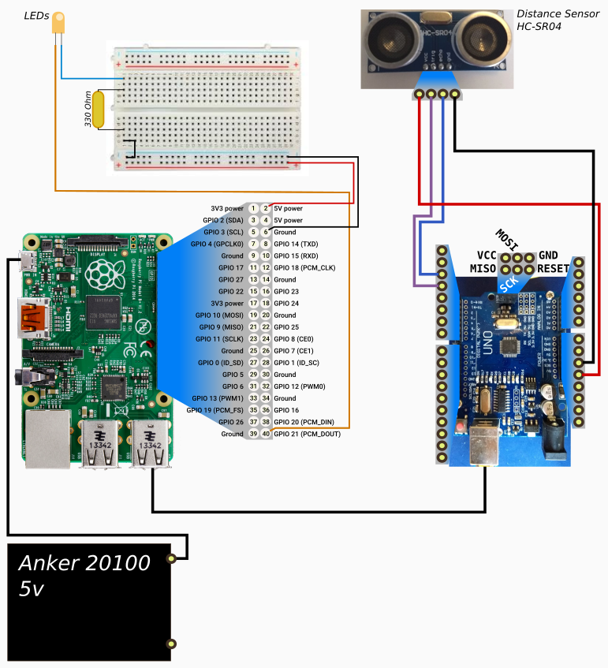

# First full example

## Plan your actions

For this first example we are using:
- a distance sensor
- an LED

Our goal is that the LED shines when we are closer than 20 cms from the sensor

## Connect all the required stuff

  

## Define your rules
- Create a file called, for instance `rulesets/start_test1.yaml`
- Copy the following and modify it to your liking:
```
--- 
- id: "test_on"                    # each rule starts with an id. Try to avoid repeating ids
  condition:                       # condition block defines what triggers the rule
  - time: "0"                      # time here defines for how long the condition must be true before we apply it
    input_objs: "distance<20"      # this defines the conditions that must be true to trigger the rule
  actionsloop: false               # once the rule is triggered, should we apply actions in a loop?
  actions:                         # actions is a list of objects to set a value to
  - object: "led_y"                # object is the name of the object as defined in your setup.yaml
    value: "1"                     # value is the...value we will set the object to
    time: "0.1"                    # time is the amount of time the value stays (only applicable if there is another action for the same object later)
- id: "test_off"
  condition:
  - time: "0.2"                         # better example than the previous, distancemust be >=20 and led_y=1 for at least 0.2 secs 
    input_objs: "distance>=20,led_y=1"  # in this example we have several conditions. All must be true.
  actionsloop: false                    # if this were true, led_y would go 0,1,0,1, then again 0,1,0,1, then again...
  actions:                              # in this example we have several actions for the same object.
  - object: "led_y"                     #   , they will be applied in order
    value: "0"                          
    time: "0.1"                         #   , and time for each action defines how long to wait until the next action can be applied
  - object: "led_y"
    value: "1"
    time: "0.2"
  - object: "led_y"
    value: "0"
    time: "0.1"
  - object: "led_y"
    value: "1"
    time: "0.4"
```

### Optional: dry test your rules
If you want to dryrun your ruleset without installing to the robot, you can do the following:
- create a new setup.yaml, call it setup_test.yaml for instance.
  - set start_actionset_file to rulesets/start_test1.yaml 
- create a new mock input file. This file "injects" messages that would be sent by the Arduino in a live setup. 
  - If your setup file was named setup_test.yaml, this file MUST be called mock_test.yaml
  - An example of the content there would look like:
```
- time: 0.2
  msg: "SENSOR: button=0|distance=39"
- time: 2.5
  msg: "SENSOR: distance=37|"
- time: 2.6
  msg: "SENSOR: distance=34|"
- time: 2.7
  msg: "SENSOR: distance=30|"
- time: 2.8
  msg: "SENSOR: button=1|distance=26|"
- time: 2.9
  msg: "SENSOR: distance=21|"
- time: 3
  msg: "SENSOR: distance=17|"
- time: 3.1
  msg: "SENSOR: distance=12|"
- time: 3.2 
  msg: "SENSOR: distance=8|"
```
- Last but not least: run on test mode
  - Since your goal is to check that it works well, we'll need at least the INFO verbosity output:
```
RUST_LOG=info cargo run test setup_test.yaml
```
, or, if you need an even more verbose level of verbose output you can use DEBUG or TRACE:
```
RUST_LOG=debug cargo run test setup_test.yaml
```


# Challenges

[PREV: Build a Chassis <--](004_Chassis.md)
