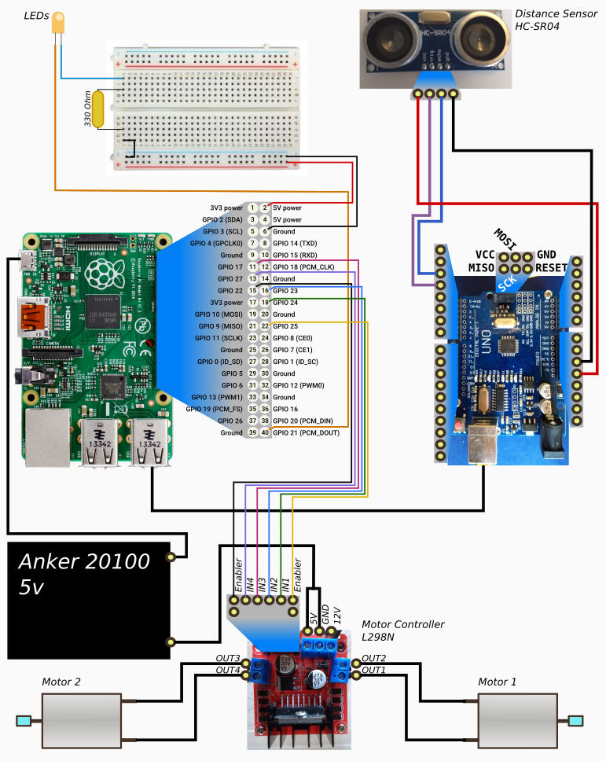

# Next Example: move the wheels based on obstacles

## Plan your actions

For this first example we are using:
- a distance sensor
- two wheels through an L298N

Our goal is that 
- If there is nothing clsoer than 20 cms, the wheels move forward.
- If there is something closer than 20 cms:
  - The wheels move backward for half a second.
  - After that half a second, one wheel moves forward, another one moves backwards for another second.
  - Obviously during all the process, we check the distance to any object and correct the phase we are in

## Connect all the required stuff

  

## Define your rules
- Create the ruleset and call it, for instance `rulesets/start_test2.yaml`
- Copy the following and modify it to your liking (see [previous example](./005_FirstExample.md) for references on what each variable does):
```
--- 
- id: "move_fwd"
  condition:
  - time: "0.05" 
    input_objs: "distance>20"
  actionsloop: false
  actions:
  - object: "motor_l"
    value: "80"
    time: "0.1"
  - object: "motor_r"
    value: "80"
    time: "0.1"
- id: "stop_n_turn"
  condition:
  - time: "0.05" 
    input_objs: "distance<=20,motor_l=80,motor_r=80"
  actionsloop: false
  actions:
  - object: "motor_l"
    value: "-80"
    time: "0.5"
  - object: "motor_r"
    value: "-80"
    time: "0.5"
  - object: "motor_l"
    value: "80"
    time: "1.0"
  - object: "motor_r"
    value: "-80"
    time: "1.0"
```

## Install and run in your Raspberry
- Turn your robot on (or connect the battery)
- Run
```
./roctl do run
```

### Reset after a failed run
If you want to return all LEDs and motors to a stand still, run:
```
./roctl do reset
```

# Challenges

[PREV: First full example <--](005_FirstExample.md) [--> NEXT: Testing a movement Ruleset](007_TestingExample.md)
